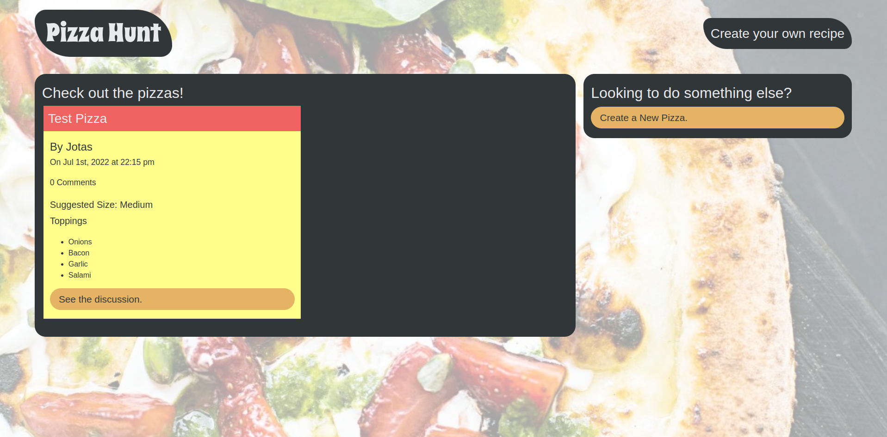
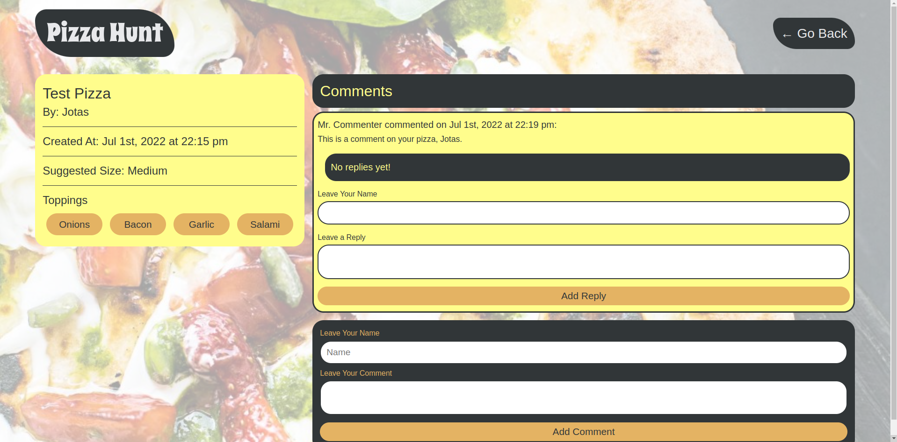

# Pizza Hunt

A social media recipe app where users can post their own pizza recipes, add comments to recipes, and create threads within comments. 

Given an existing front-end, I added back-end functionality (RESTful API, MongoDB).

## Screenshots

## Built With
* JavaScript
* Express
* NoSQL/MongoDB
* Mongoose

## Website
https://pizza-hunt-bc.herokuapp.com/

## What I Learned
* Differences between SQL and NoSQL databases
* Configuring Heroku for deployment of a Node.js application using MongoDB
* Executing CRUD methods with MongoDB
* Integrating Mongoose in a full-stack web application
* Creating query builders to populate documents using refs
* Implementing client-side NoSQL using IndexedDB
